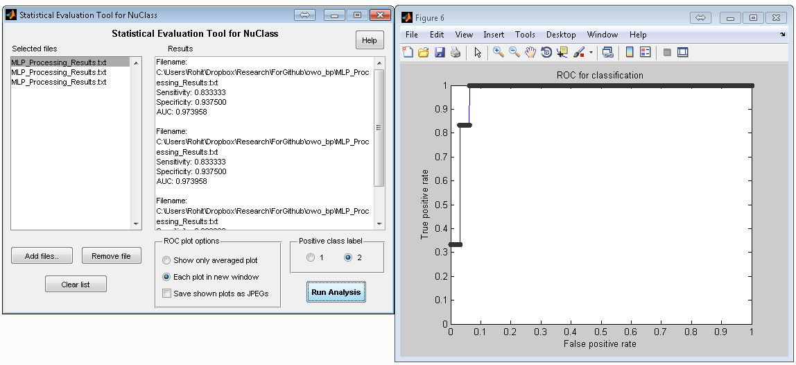

Statistical Evaluation Tool for Classifiers
===========================================

Tool to perform sensitivity, specificity, ROC curve, and AUC computation on
classifier results, and generate averaged plots and AUC values for cross-testing.

Author: Rohit Rawat (rohit.rawat@mavs.uta.edu)  
Created: 06/26/2012  
Updated: 08/26/2015

Image Processing and Neural Networks Lab, UT Arlington

MLP Classifiers (recommended), RBF Classifiers, and NuClass (NuClass is now deprecated)
can be obtained from: http://www.uta.edu/faculty/manry/

**Run the script `stats_tool.m` to start the GUI**. (Do not open the.fig file!).
The GUI is self explanatory. The command line version is also included.

Help
----
This tool accepts processing results files generated by classifiers, and performs
sensitivity, specificity, ROC curve, and AUC computation.
* Run the MOLF-ADAPT, MOLF-ADAPT-MERGE, RBF, or NuClass programs to train a
neural network.
* Then run the corresponding testing/processing programs to produce the
processing result files for each cross-validation data set, saving them under
different names.
* Click the Add files button to add these files to the list of files. The
remove and clear buttons work as advertised.
* Starting the analysis will produce an ROC curve and AUC value for each file.
The averaged ROC curve, and average AUC values will also be displayed. The
tool can also be run for just a single file if cross-testing is not performed.

### ROC plot options
* To display the ROC plot for each validation file, select "Each plot in new
window". To only display the averaged plot, select the other option. The
averaged plot will be displayed in both the cases.
* To save the displayed plots as JPEG files in the current directory, check the box
underneath. The JPEG files will have the same names as the processing
results files, but with a JPEG extension. The averaged plot is saved as
"averaged_ROC_plot.jpg".
* The positive class label should be set to 1 or 2, depending on what label has
been used for the positive class. The negative class (or the control class) is
automatically assigned the other label.

Examples
--------
For an application in producing cross-validation ROC curves, please see:
A. Yennu, F. Tian, H. Liu, R. Rawat, M. T. Manry, and R. Gatchel,
“A preliminary investigation of human frontal cortex under noxious thermal 
stimulation over the temporomandibular joint using functional near infrared 
spectroscopy,” Journal of Applied Biobehavioral Research, vol. 18, no. 3, pp. 
134–155, 2013.

